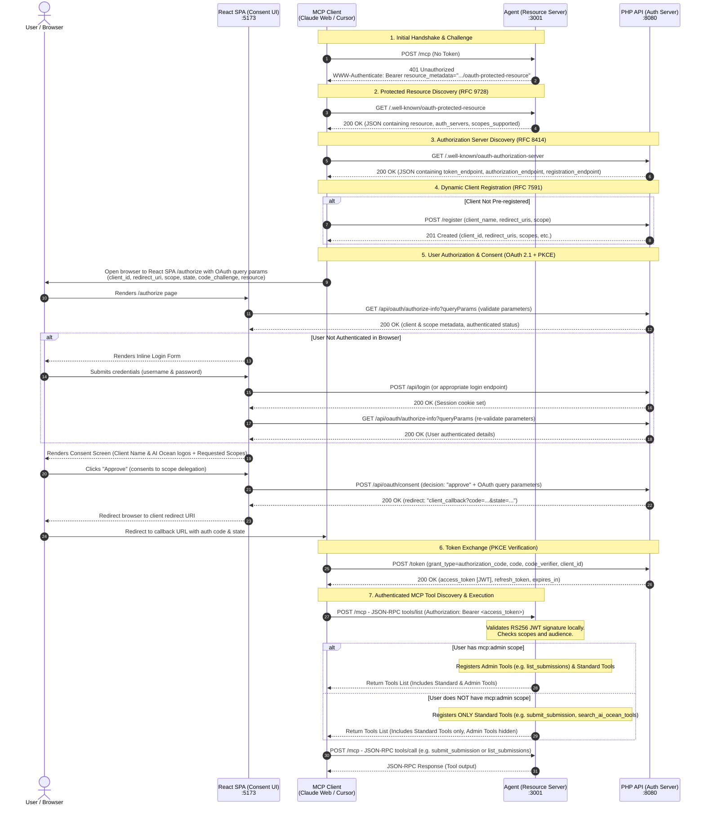

# MCP OAuth 2.1 Authorization Flow

This document details the standard **Model Context Protocol (MCP) OAuth 2.1** flow implemented in the AI Ocean system. It enables external MCP clients (such as the Claude Web App, Cursor IDE, or MCPJam Inspector) to securely authorize against the AI Ocean backend and execute tools hosted by the AI Ocean Agent.

---

## Architectural Components

The authorization architecture consists of the following services:

1. **MCP Client**: The client application (e.g., Claude Web App, Cursor, MCPJam) requesting access to AI Ocean tools.
2. **Agent (Resource Server)**: Runs on port `3001`. Exposes the main MCP endpoint (`/mcp`) and is responsible for verifying JWTs and executing tools. Code is located in:
   - [auth-middleware.ts](file:///home/light/projects/aiocean/packages/agent/src/auth-middleware.ts) — handles local token verification and challenges.
   - [routes.ts](file:///home/light/projects/aiocean/packages/agent/src/routes.ts) — contains the Honos-based `/mcp` and `/.well-known/oauth-protected-resource` route definitions.
   - [server.ts](file:///home/light/projects/aiocean/packages/agent/src/mcp/server.ts) — instantiates the stateless `McpServer` and registers tools dynamically depending on the user's role.
3. **React SPA (Consent UI)**: Runs on port `5173` (web frontend). Renders the unified login and consent screen at the `/authorize` route. Code is located in:
   - [AuthorizePage.tsx](file:///home/light/projects/aiocean/packages/web/src/pages/AuthorizePage.tsx) — fetches authorization parameters from query params, validates them, handles inline login, and submits user consent.
4. **PHP API (Authorization Server)**: Runs on port `8080`. Built with `league/oauth2-server`, it manages OAuth client registries, authorization codes, user sessions, and signs the RS256 JWT access tokens. Code is located in:
   - [OAuthController.php](file:///home/light/projects/aiocean/packages/api/src/Features/OAuth/OAuthController.php) — endpoints for discovery, registration, token exchange, authorization-info validation, and consent approvals.
   - [routes.php](file:///home/light/projects/aiocean/packages/api/src/Features/OAuth/routes.php) — exposes OAuth routes on the PHP backend.

---

## Sequence Diagram

Below is the complete end-to-end sequence diagram showing the interactions between the MCP Client, the User's Browser, the Agent, the React SPA, and the PHP API.



---

## Detailed Step-by-Step Flow

### 1. Initial Handshake & Challenge
When the MCP Client attempts to connect or execute a tool on the Agent (`POST /mcp`) without providing a token, the Agent responds with a `401 Unauthorized` status.
- It includes a `WWW-Authenticate` header pointing to its Protected Resource Metadata (PRM) document.
- Example Header:
  ```http
  WWW-Authenticate: Bearer resource_metadata="http://localhost:3001/.well-known/oauth-protected-resource", scope="mcp:user"
  ```
- Code handling: [auth-middleware.ts](file:///home/light/projects/aiocean/packages/agent/src/auth-middleware.ts#L53-L67).

### 2. Protected Resource Discovery (RFC 9728)
The client fetches the metadata document from the URL specified in `resource_metadata`:
- **Request**: `GET http://localhost:3001/.well-known/oauth-protected-resource`
- **Response**:
  ```json
  {
    "resource": "http://localhost:3001/mcp",
    "authorization_servers": ["http://localhost:8080"],
    "scopes_supported": ["mcp:user", "mcp:admin"],
    "bearer_methods_supported": ["header"]
  }
  ```
- Code handling: [routes.ts](file:///home/light/projects/aiocean/packages/agent/src/routes.ts#L25-L33).

### 3. Authorization Server Discovery (RFC 8414)
Using the authorization server URI (`http://localhost:8080`), the client constructs the metadata discovery URL to fetch the server configuration:
- **Request**: `GET http://localhost:8080/.well-known/oauth-authorization-server`
- **Response**:
  ```json
  {
    "issuer": "http://localhost:8080",
    "authorization_endpoint": "http://localhost:5173/authorize",
    "token_endpoint": "http://localhost:8080/token",
    "registration_endpoint": "http://localhost:8080/api/oauth/register",
    "response_types_supported": ["code"],
    "grant_types_supported": ["authorization_code", "refresh_token"],
    "code_challenge_methods_supported": ["S256"],
    "token_endpoint_auth_methods_supported": ["none"],
    "scopes_supported": ["mcp:user", "mcp:admin"]
  }
  ```
- Code handling: `metadata()` in [OAuthController.php](file:///home/light/projects/aiocean/packages/api/src/Features/OAuth/OAuthController.php#L44-L62).

### 4. Dynamic Client Registration (RFC 7591)
If the client is not pre-registered, it dynamically registers itself with the authorization server:
- **Request**: `POST http://localhost:8080/api/oauth/register`
  ```json
  {
    "client_name": "My MCP Client",
    "redirect_uris": ["http://localhost:3000/callback"],
    "scope": "mcp:user"
  }
  ```
- **Response**:
  ```json
  {
    "client_id": "b0a68d...",
    "client_name": "My MCP Client",
    "redirect_uris": ["http://localhost:3000/callback"],
    "scope": "mcp:user"
  }
  ```
- Code handling: `register()` in [OAuthController.php](file:///home/light/projects/aiocean/packages/api/src/Features/OAuth/OAuthController.php#L67-L127).

### 5. User Authorization & Consent (OAuth 2.1 with PKCE)
1. The client generates a random cryptographically secure string `code_verifier` and computes the `code_challenge = BASE64URL-ENCODE(SHA256(ASCII(code_verifier)))`.
2. It redirects the user's browser to the React SPA: `http://localhost:5173/authorize?response_type=code&client_id=...&redirect_uri=...&scope=mcp:user&state=...&code_challenge=...&code_challenge_method=S256&resource=http://localhost:3001/mcp`.
3. The React page ([AuthorizePage.tsx](file:///home/light/projects/aiocean/packages/web/src/pages/AuthorizePage.tsx)) validates parameters by querying `GET /api/oauth/authorize-info` from the PHP backend.
4. If the user is not authenticated, they log in inline without leaving the page.
5. The React page renders the consent UI showing the requested scopes.
6. The user clicks **Approve**, prompting the React app to send `POST /api/oauth/consent` (with the decision and original OAuth parameters) to the PHP API.
7. The PHP API generates the authorization code and returns:
   ```json
   {
     "redirect": "http://localhost:3000/callback?code=AUTH_CODE&state=STATE"
   }
   ```
8. The React app redirects the browser to that URL, returning the code to the MCP Client.
- Code handling: [AuthorizePage.tsx](file:///home/light/projects/aiocean/packages/web/src/pages/AuthorizePage.tsx#L193-L206) and `consent()` in [OAuthController.php](file:///home/light/projects/aiocean/packages/api/src/Features/OAuth/OAuthController.php#L186-L237).

### 6. Token Exchange
The MCP Client exchanges the code for tokens:
- **Request**: `POST http://localhost:8080/token`
  ```form-urlencoded
  grant_type=authorization_code
  code=AUTH_CODE
  redirect_uri=http://localhost:3000/callback
  client_id=CLIENT_ID
  code_verifier=VERIFIER
  ```
- The server checks the `code_challenge` matches the SHA-256 hash of the `code_verifier`.
- **Response**:
  ```json
  {
    "access_token": "JWT_ACCESS_TOKEN_STRING",
    "refresh_token": "REFRESH_TOKEN_STRING",
    "token_type": "Bearer",
    "expires_in": 3600
  }
  ```
- Code handling: `token()` in [OAuthController.php](file:///home/light/projects/aiocean/packages/api/src/Features/OAuth/OAuthController.php#L243-L250).

### 7. Authenticated MCP Tool Discovery & Execution
1. **Tool Discovery (`tools/list`)**:
   - The MCP Client sends a JSON-RPC request to discover tools by calling `POST http://localhost:3001/mcp` with `Authorization: Bearer <access_token>` in the headers, requesting `tools/list`.
   - The Agent's authentication middleware ([auth-middleware.ts](file:///home/light/projects/aiocean/packages/agent/src/auth-middleware.ts)) intercepts the request, parses the RS256 JWT, and validates it locally using the PHP API's public key (retrieved from `packages/api/storage/oauth/public.key`). No database query is made.
   - The Hono route handler ([routes.ts](file:///home/light/projects/aiocean/packages/agent/src/routes.ts#L44-L53)) extracts the scopes and user role.
   - **Admin Scope Check & Registration**: The Agent checks if the user possesses the `mcp:admin` scope.
     - If yes, the Agent's [server.ts](file:///home/light/projects/aiocean/packages/agent/src/mcp/server.ts#L35-L40) registers both standard tools (e.g. `submit_submission`, `search_ai_ocean_tools`) and admin-only tools (e.g. `list_submissions`, `decide_submission`).
     - If no, the Agent registers **only** standard tools. Admin tools are not registered on the `McpServer` instance at all, completely hiding them from the MCP client.
   - The Agent returns the list of registered tools back to the client.
2. **Tool Execution (`tools/call`)**:
   - The MCP Client invokes a specific tool from the permitted list by sending a `tools/call` JSON-RPC request to `POST http://localhost:3001/mcp`.
   - The Agent verifies the token, runs the requested tool, and returns the execution results.
- Code handling: [routes.ts](file:///home/light/projects/aiocean/packages/agent/src/routes.ts#L44-L53) and [server.ts](file:///home/light/projects/aiocean/packages/agent/src/mcp/server.ts#L49-L54).

---

## Security Highlights

- **PKCE (Proof Key for Code Exchange)** is strictly required for authorization code exchanges, protecting public clients against authorization code interception attacks.
- **Resource Indicators (RFC 8707)** are enforced to bind the access token's audience (`aud`) specifically to the Agent's resource URL (`http://localhost:3001/mcp`), mitigating token replay/passthrough risks on other servers.
- **Stateless Verification** via signed RS256 JWTs allows the Hono Agent to verify tokens locally with sub-millisecond latency.
