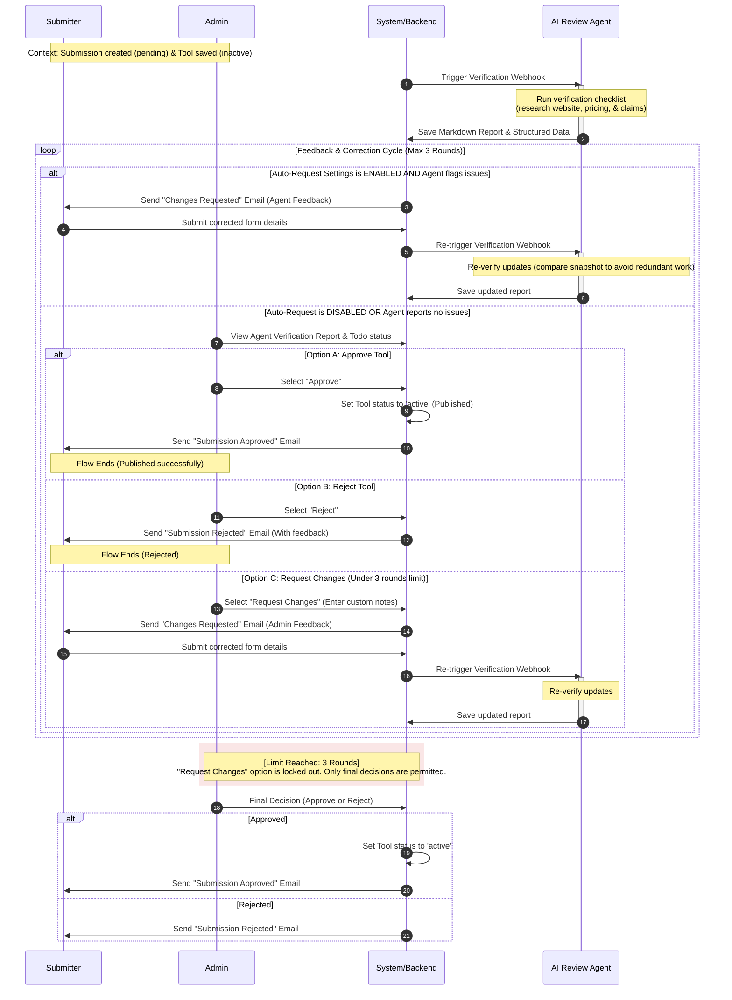

# Tool Review Process Sequence Diagram

This sequence diagram illustrates the lifecycle of the **Review Process** on **AIOcean** after a tool has been successfully submitted. It focuses on the interactions between the **Submitter**, **System/Backend**, **AI Review Agent**, and the **Admin**, depicting both the automated settings paths and the human decision points within the 3-round revision limit.

---

## Sequence Diagram

---

## Process Participant Roles

* **Submitter**: Receives feedback notifications, uses the prefilled form URL to adjust details, and resubmits the tool.
* **System/Backend**: Manages the database state (e.g. keeping track of the revision count), checks auto-review configuration settings, routes notifications, and transitions the tool status to `active` upon final approval.
* **AI Review Agent**: A background execution service that verifies the submitter's inputs against web searches, drafts verification checklists, writes the markdown review report, and generates structured feedback data.
* **Admin**: The final gatekeeper who views the agent's work and makes manual approval, rejection, or feedback requests.
