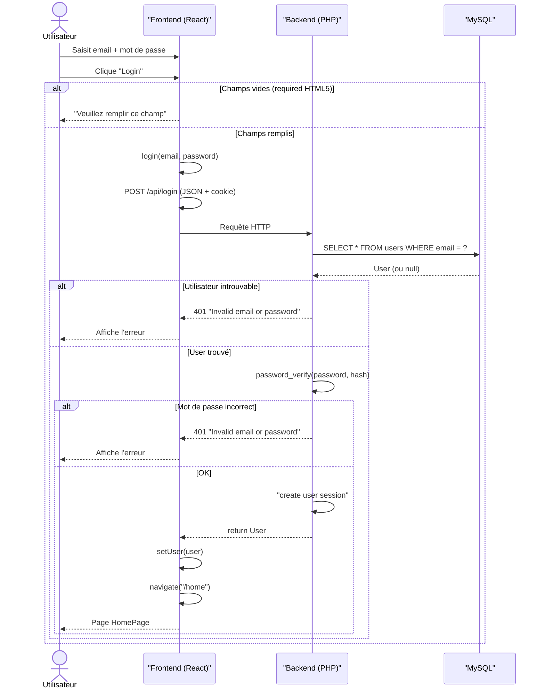

```mermaid
sequenceDiagram
    actor U as Utilisateur
    participant F as "Frontend (React)"
    participant B as "Backend (PHP)"
    participant DB as "MySQL"

    U->>F: Saisit email + mot de passe
    U->>F: Clique "Login"

    alt Champs vides (required HTML5)
        F-->>U: "Veuillez remplir ce champ"
    else Champs remplis
        F->>F: login(email, password)
        F->>F: POST /api/login (JSON + cookie)
        F->>B: Requête HTTP

        B->>DB: SELECT * FROM users WHERE email = ?
        DB-->>B: User (ou null)

        alt Utilisateur introuvable
            B-->>F: 401 "Invalid email or password"
            F-->>U: Affiche l'erreur
        else User trouvé
            B->>B: password_verify(password, hash)
            alt Mot de passe incorrect
                B-->>F: 401 "Invalid email or password"
                F-->>U: Affiche l'erreur
            else OK
                B->>B: "create user session"
                B-->>F: return User
                F->>F: setUser(user)
                F->>F: navigate("/home")
                F-->>U: Page HomePage
            end
        end
    end
```
