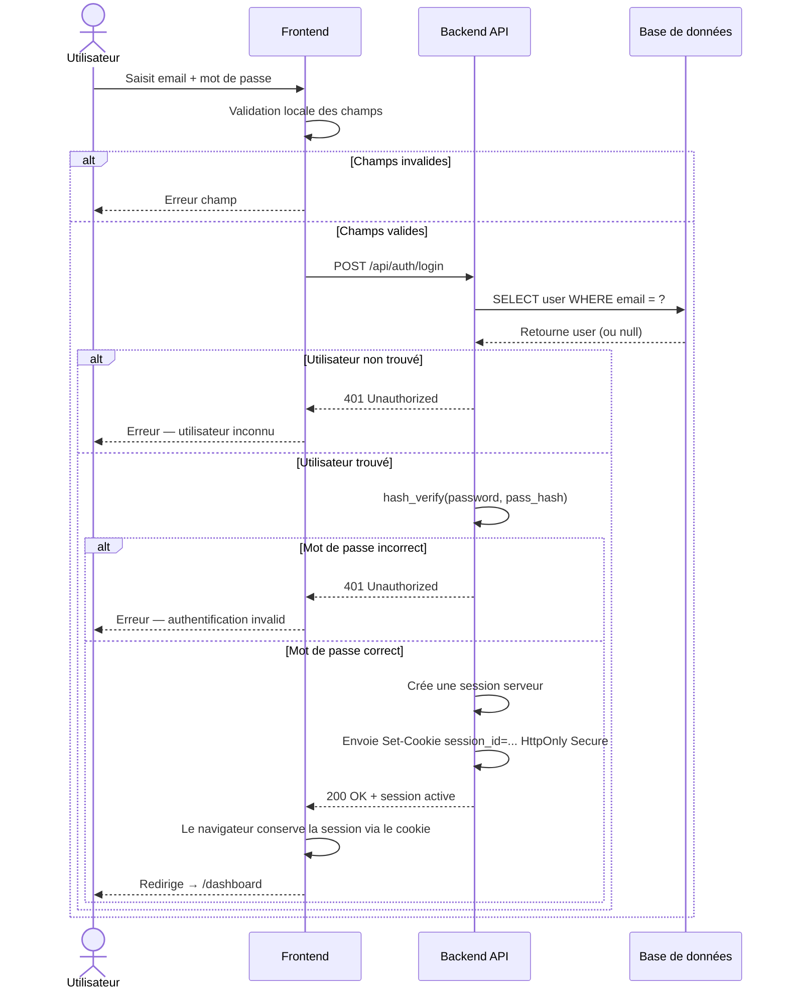

```mermaid
sequenceDiagram
    actor U as Utilisateur
    participant F as Frontend
    participant B as Backend API
    participant DB as Base de données

    U->>F: Saisit email + mot de passe
    F->>F: Validation locale des champs

    alt Champs invalides
        F-->>U: Erreur champ
    else Champs valides
        F->>B: POST /api/auth/login
        B->>DB: SELECT user WHERE email = ?
        DB-->>B: Retourne user (ou null)

        alt Utilisateur non trouvé
            B-->>F: 401 Unauthorized
            F-->>U: Erreur — utilisateur inconnu
        else Utilisateur trouvé
            B->>B: hash_verify(password, pass_hash)

            alt Mot de passe incorrect
                B-->>F: 401 Unauthorized
                F-->>U: Erreur — authentification invalid 
            else Mot de passe correct
                B->>B: Crée une session serveur
                B->>B: Envoie Set-Cookie session_id=... HttpOnly Secure
                B-->>F: 200 OK + session active
                F->>F: Le navigateur conserve la session via le cookie
                F-->>U: Redirige → /dashboard
            end
        end
    end
```
